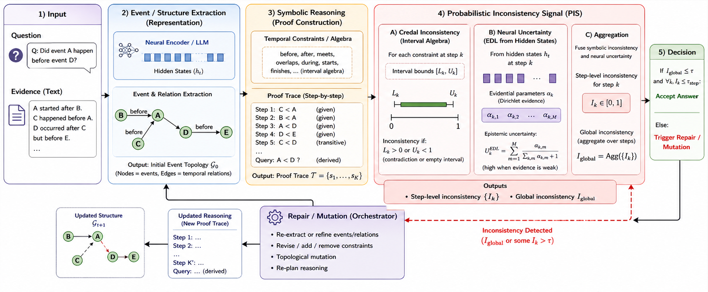

# Probabilistic Inconsistency Signal for Neuro-Symbolic Temporal QA

<p align="center">
Reference implementation accompanying the manuscript

Temporal Reasoning Is Not the Bottleneck:
A Probabilistic Inconsistency Framework for Neuro-Symbolic QA
</p>

<p align="center">
  <a href="#overview">Overview</a> •
  <a href="#key-contributions">Contributions</a> •
  <a href="#repository-structure">Structure</a> •
  <a href="#installation">Installation</a> •
  <a href="#datasets">Datasets</a> •
  <a href="#running-experiments">Experiments</a> •
  <a href="#results">Results</a> •
  <a href="#citation">Citation</a>
</p>

---

## Overview

Neuro-symbolic temporal QA systems extract events and constraints from text, then reason over them with a symbolic engine. When these systems produce a wrong answer, there is no way to tell whether the extraction was wrong or the reasoning was wrong both look identical at the output level.

This ambiguity has led the field to assume that LLMs are fundamentally weak at temporal deduction. This repository implements a framework built to test that assumption directly, by making extraction errors and reasoning errors distinguishable at the step level.

The core idea is the **Probabilistic Inconsistency Signal (PIS)**: a per-step score that fuses symbolic credal-interval contradictions with epistemic uncertainty estimated from an LLM's hidden states. PIS is used both to diagnose *where* a proof trace fails and to route repair replanning for perceptual uncertainty, structural mutation for hard symbolic contradiction.

## Key Contributions

- **Decoupled architecture**: separates event/structure extraction from symbolic deduction instead of treating temporal QA as end-to-end generation.
- **Fused uncertainty signal**: combines credal-interval bounds with EDL-derived epistemic uncertainty into a single step-level inconsistency score (PIS).
- **Diagnosis-driven repair**: an MCTS orchestrator selects between evidence replanning and structural mutation based on the source of the inconsistency.
- **Controlled isolation of the bottleneck**: evaluates across benchmarks with decreasing structural supervision to attribute errors to representation rather than reasoning.

---

## Method

<p align="center">
  
</p>
<p align="center"><sub>Figure 1. Text is compiled into an event graph, reasoned over as a symbolic proof trace, and continuously monitored by the PIS, which drives MCTS-based repair.</sub></p>

| Stage | Component |
|---|---|
| Event / relation extraction | `src/component1_retriever.py`, `src/component2_symbolic.py` |
| Probabilistic Inconsistency Signal | `src/component3_probabilistic.py` |
| Repair orchestration (MCTS) | `src/orchestrator.py` |
| Benchmark loading and scoring | `src/temporal_benchmark.py` |

---

## Repository Structure

```
.
├── configs/        # experiment configuration files
├── datasets/        # benchmark data (raw and processed)
├── docs/           # additional documentation
├── figures/         # paper and README figures
├── results/         # evaluation outputs (JSON)
├── scripts/         # benchmark entry points
├── src/            # core framework implementation
├── tests/          # unit tests
└── requirements.txt
```

Each directory maps to one stage of the pipeline described above; see [Method](#method) for details on `src/`.

---

## Installation

```bash
git clone https://github.com/liemtranq/NeurIPS-2026.git
cd <repository-name>
pip install -r requirements.txt
```

The framework uses a frozen LLM (Llama-3-70B-Instruct in the reported experiments) as its perception module. Reproducing the full pipeline requires access to the corresponding model weights and sufficient accelerator memory to host a 70B-parameter model; reported experiments were run on AMD MI300X accelerators.

The repository is currently under active cleanup for public release following the review process. Detailed setup and environment documentation will be added to `docs/` at that time.

---

## Datasets

| Dataset | Structural tier | Role |
|---|---|---|
| Synthetic Temporal-200 | Structured | Upper-bound check on deduction with explicit event structure |
| TempReason (L1) | Structured | Explicit-structure temporal reasoning |
| TimeX-NLI | Semi-structured | Noisy, partially grounded temporal relations |
| TRACIE | Unstructured | Narrative-heavy, highly implicit event structure |

Processed splits are expected under `datasets/processed/` and `datasets/TempReason/`. Source datasets are not redistributed here — see the original releases cited in the paper.

---

## Running Experiments

Each benchmark has a dedicated entry point under `scripts/`:

```bash
python scripts/run_temporal_benchmark_200.py
python scripts/run_tracie_eval.py
python scripts/unified_benchmark_runner.py   # all benchmarks
```

Configuration (model path, PIS hyperparameters, thresholds) and full usage documentation will be published alongside the cleaned-up release.

---

## Results

Accuracy under decreasing structural supervision (zero-shot, frozen Llama-3-70B-Instruct):

| Method | Synthetic | TempReason | TimeX-NLI | TRACIE |
|---|---|---|---|---|
| Neural (LLM) | 56.3 | 46.8 | 55.0 | 50.1 |
| Symbolic | 100.0 | 100.0 | 63.2 | 50.0 |
| Neuro-symbolic (w/o PIS) | 100.0 | 100.0 | 68.4 | 50.3 |
| **Ours (PIS)** | **100.0** | **100.0** | **75.1** | 50.2 |

**Observations**

- Accuracy is perfect on fully structured benchmarks, with zero false positives and false negatives.
- Accuracy degrades monotonically as structural supervision decreases.
- PIS improves accuracy specifically in the semi-structured regime (TimeX-NLI), where partial noise is recoverable.
- On the unstructured benchmark (TRACIE), all errors are false negatives — consistent with missing event extraction rather than faulty deduction.
- Ablations (reported in the paper) show the largest drop from removing PIS entirely, followed by removing step-level aggregation.

Full ablation and diagnostic tables are reported in the paper.

---

## Citation

```bibtex
@misc{tran2026pis,
  title={Temporal Reasoning Is Not the Bottleneck: A Probabilistic Inconsistency Framework for Neuro-Symbolic QA},
  author={Tran, Quang Liem},
  year={2026},
  note={Manuscript}
}
```

Citation information will be updated if a peer-reviewed version becomes available.

## License

This project is released under the MIT License.
See LICENSE for details.
